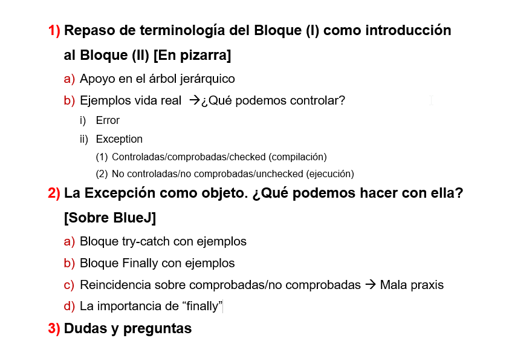

<b>TITULO DEL PROYECTO: </b>Ejemplos de excepciones

<b>PROPOSITO DEL PROYECTO:  </b>Ejemplos en BlueJ sobre el control de excepciones como apoyo
a la presentacion del Bloque (II) de Control de Excepciones.
FECHA: 2018-05-29

  

